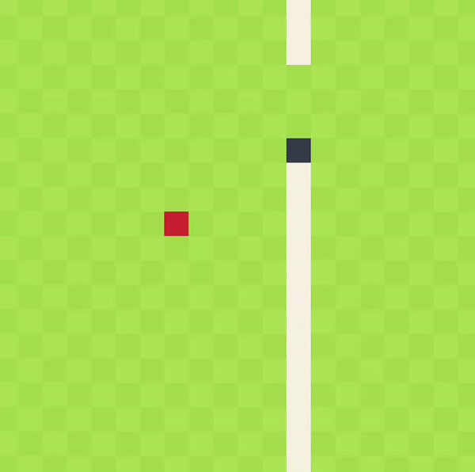

ggez-snake &middot; 🐍
=====
Classic snake game just to test if rust is in game yet? [Are we game yet?](https://arewegameyet.rs/)
used ggez just to fool around, I checked gegez snake [example](https://github.com/ggez/ggez/blob/master/examples/04_snake.rs) but couldn't understand and created my own.
Maybe someday, I will implement it on WASM.

## Demo


## Running The Application
-   **Rust and Cargo:** Make sure to have latest version of rustc and cargo installed in your computer: [https://www.rust-lang.org/tools/install](https://www.rust-lang.org/tools/install)
```bash
git clone https://github.com/BipulLamsal/ggez-snake
cd ggez-snake
```

```bash
# directly run via
cargo run
# or build
cargo build --release
./target/release/ggez-snake
```


